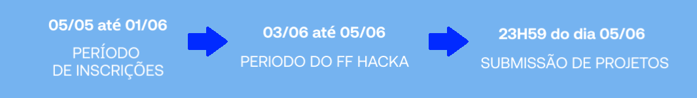
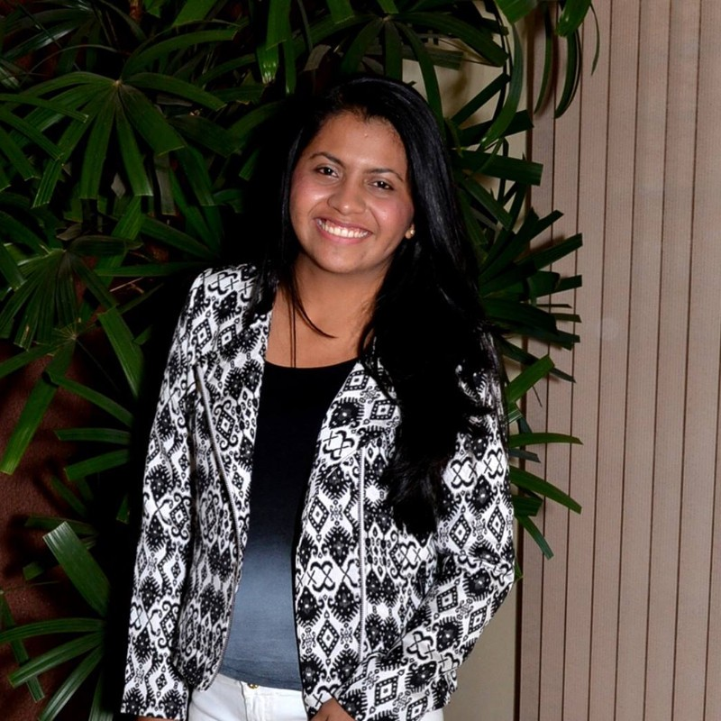
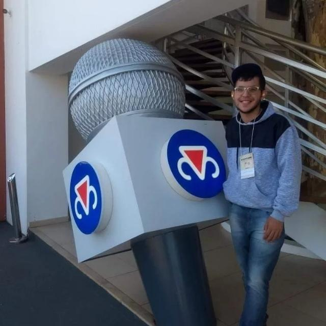
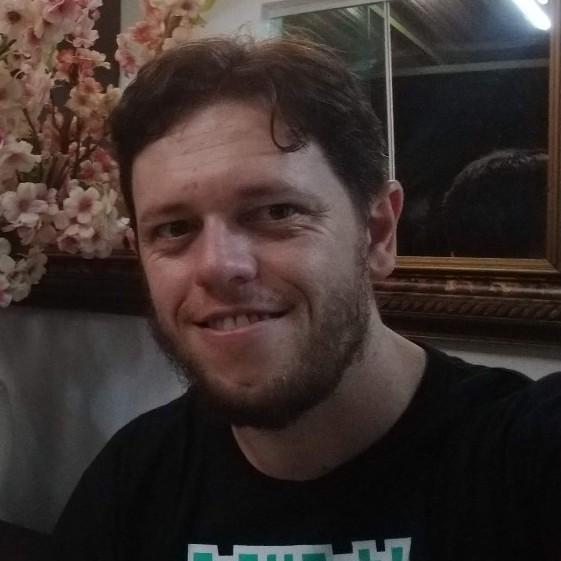

# Hackathon Fair Fax 

O Hackathon Fair Fax é um evento realizado pelo grupo para promover soluções diferenciadas para problemas reais, assegurando um crescimento sustentável e proporcionando um relacionamento de longo prazo.

 

  <a href="#desafio">Desafio</a> •
  <a href="#material">Material</a> •
  <a href="#projeto">Projeto</a> •
  <a href="#ferramentas">Ferramentas</a> •
  <a href="#integrantes">Integrantes</a> •
  <a href="#licença">Licença</a>

## Desafio

EcoParking para Bicicletas

#### Contextualização

As bicicletas estão ganhando cada vez mais espaço na vida e na rotina dos paulistanos (e dos brasileiros!). Finalmente passaram a ser reconhecidas como uma boa alternativa de transporte, pelos mais diversos fatores – de sustentabilidade à custo, passando por saúde, por exemplo – vemos os habitantes de uma das maiores cidades da América Latina abraçando a ideia de considerar as ‘magrelas’ em suas rotinas e compromissos.

A capital do estado de SP tem números bastante interessantes: conta com mais de 1,6 milhões de bicicletas, mas apenas uma pequena porcentagem delas, de 0,5% (cerca de 9 mil), circulam regularmente pela cidade, de acordo com um estudo inédito realizado pela Companhia de Engenharia de Tráfego (CET). E os dados continuam a impressionar! Segundo a Associação Brasileira do Setor de Bicicletas (Aliança Bike), as bikes se tornaram objeto de desejo, já que a frota da cidade cresceu cerca de 66% em 2020, em comparação com o ano anterior.

São Paulo tem ainda mais pontos a favor das bicicletas, já que tem recebido mais ciclovias, passando a contar com 681 km de faixas exclusivas em 2021. São quase 200 km a mais do que em 2016, quando havia apenas 504 km disponíveis para pedalar. A atual gestão da cidade promete ainda mais, querendo entregar mais 300km de ciclovias até o final de seu mandato. Este crescimento tem se acentuado com a pandemia, porque muitas pessoas passaram a enxergar na bicicleta uma alternativa segura e saudável para sua locomoção, além, é claro, no notável aumento de entregadores dos aplicativos e serviços em geral. 

Mas nem tudo são flores: o que se percebeu foi que andar de bicicleta na cidade ainda é visto como um ato de coragem, pois São Paulo – ao que tudo indica – foi construída para os carros. Apenas 3,4% das vias comportam ciclistas e veículos de forma adequada e segura. Fora isso, sabe-se que a malha cicloviária ainda não chegou às regiões consideradas periféricas da cidade, tornando inviável o uso das magrelas como meio de transporte para o trabalho, por exemplo, para quem mora nestas regiões. A infraestrutura também deixa a desejar, uma vez que nem sempre é possível contar com locais adequados para guardar as bicicletas e o número de pontos onde se pode fazer a manutenção das mesmas são raridade.

#### Problema

Como podemos criar pontos de suporte, estacionamento e manutenção de bicicletas para os ciclistas, transformando a cidade em um local mais amigável para as pessoas e suas bikes, estimulando seu uso no dia a dia?

## Material

Veja todo o material produzido para este desafio nos seguintes links:

- [Vídeo Pitch](#)
- [Vídeo Demo](#)
- [Apresentação em PDF](#)
- [App desenvolvido](#)
- [Código fonte](#)

## Projeto

A plataforma "nome-que-definimos" está aí para resolver o problema relacionado a ......

Os ciclistas querem saúde, segurança, comodidade, qualidade de vida e tudo isso no alcance de seus pés. .....

Etc .......

## Ferramentas

<ul>
<li>Miro</li>
<li>Canvas</li>
<li>GitHub</li>
<li>HTML</li>
<li>CSS</li>
<li>Java Script</li>
<li>C Sharp</li>
<li>VSCode</li>
<li>Discord</li>
</ul>

## Integrantes

<table>
<tr>
    <td> Ellen Camila</td>
    <td> Gustavo Pascoal</td>
    <td> Gustavo Dias</td>
    <td> Leandro Machado</td>
    <td> Robson Silva</td>
  </tr>
  <tr>
    <td><a href="https://www.linkedin.com/in/ellencamilacardias/" target="_blank">Linkedin</a></td>
    <td><a href="https://www.linkedin.com/in/gpascoal/" target="_blank">Linkedin</a></td>
    <td><a href="https://www.linkedin.com/in/gustavopereiradias" target="_blank">Linkedin</a></td>
    <td><a href="https://www.linkedin.com/in/leandro275/" target="_blank">Linkedin</a></td>
    <td><a href="https://github.com/rjsilvaoficial" target="_blank">Linkedin</a></td>
  </tr>
  </table>

## Licença

Esse projeto está sob a licença MIT. Veja o arquivo [LICENSE](LICENSE.md) para mais detalhes.
